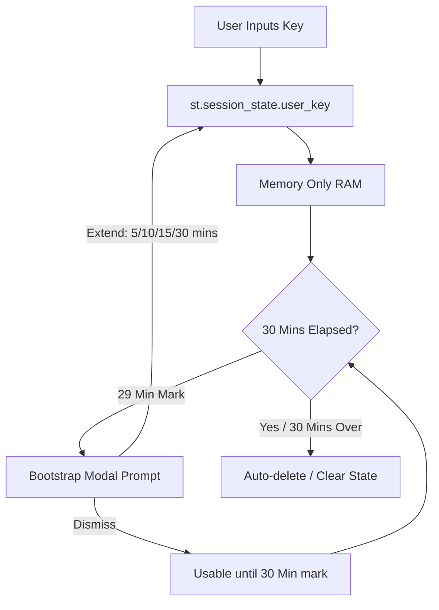
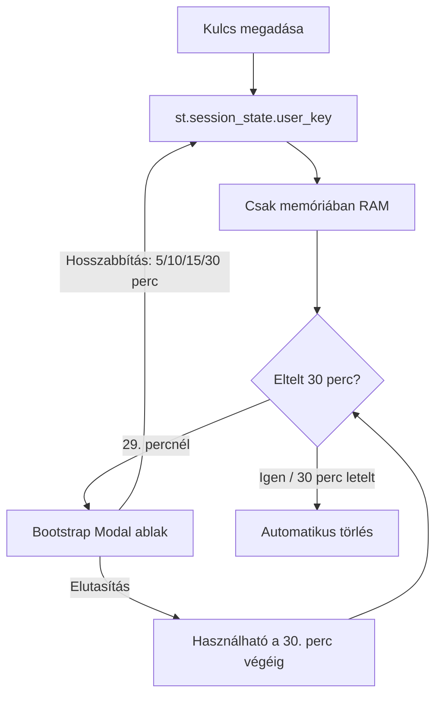

# VisualBridge – API Usage and Key Management / API használat és kulcskezelés

This document describes how VisualBridge operates with and without a Gemini API key, and details the security and implementation guidelines for allowing external users to use their own keys.

Ez a dokumentum bemutatja, hogyan működik a VisualBridge Gemini API kulccsal és anélkül, valamint részletezi a biztonsági és implementációs irányelveket a saját kulcsok használatához.

---

## Language / Nyelv

- [English Documentation](#english-documentation)
- [Magyar dokumentáció](#magyar-dokumentáció)

---

## English Documentation

### 1. Operation Without an API Key (Mock / Simulation Mode)

When the application starts without a valid `GEMINI_API_KEY` (or the placeholder is left intact in `.env`), it automatically boots into **Mock Mode**.

Contrary to expectation, users are **not strictly limited** to the 3 preconfigured templates (Neutral, Boy, and Girl). They can type custom text, which the system processes as follows:

- **No AI Text Simplification**: The Text Simplification Agent (Gemini) is disabled. The system falls back to a simple regular expression to split the input text into sentences at punctuation marks (`.`, `!`, `?`).
- **Heuristic Keyword Extraction**: Instead of smart AI mapping, the system uses a basic stopword filter to strip out common Hungarian and English structural words. Words longer than 2 characters that are not stopwords are treated as keywords.
- **Keyless Symbol Lookup**: The ARASAAC API is a free, public REST API and **does not require an API key**. The system queries these heurstically extracted keywords directly from the ARASAAC database.
- **Predefined Profiles**: The three default profiles (Neutral, Boy, Girl) use deterministic, pre-translated mock templates to showcase the ideal output quality of the AI model.

---

### 2. User-Provided API Key Integration

To allow users to access full Gemini-powered AI features without registering or sharing your server key, you can implement a front-end input form.

#### Why URL-based Key Injection is NOT Recommended

Passing the API key as a query parameter in the URL (e.g., `https://visualbridge.app/?key=AIzaSy...`) is a security vulnerability:

1. **Browser History**: The key remains visible in the browser's navigation history.
2. **Server & Proxy Logs**: The URL is stored in plain text in webserver, reverse-proxy (e.g., Nginx, Apache), and CDN logs.

> *Note: Referer leakage is not an active issue at this time as there are no external reference pages.*

#### Recommended Security Pattern: In-Memory Session State with Expiration

The safest way to handle user-provided keys is an **in-memory sidebar form** combined with a session expiration mechanism.

- **Storage**: Store the key in Streamlit's `st.session_state`. Session state data resides entirely in the server's RAM, bound to a specific WebSocket connection. It is never written to disk and is completely isolated from other users.
- **Transport**: All WebSocket communications must run over **HTTPS (WSS)** so the key is encrypted in transit.
- **User Interface (Collapsible Settings)**: The key input field is kept hidden inside a collapsible sidebar expander labeled with a key icon (`🔑 API Key Settings`). Inside this expander, the input field uses `type="password"` (hidden characters with a show/hide toggle).
- **Invalid Key Handling**: If a user enters an incorrect key and the API returns an authorization error, the app displays a prominent guide directing the user to reopen the expander and replace the key.
- **Absolute Expiration Timer**: The key is kept in memory for a maximum duration of **30 minutes from the time it was submitted**.
- **Session Extension Prompt**: Exactly **1 minute before expiration** (at the 29-minute mark), a Bootstrap modal dialog pops up, prompting the user if they wish to extend their session.
- **Extension Options**: If the user chooses to extend, they are presented with a selection of **5, 10, 15, or 30 minutes** to keep their session active. If the modal is dismissed, the key remains usable for the remaining 1 minute until the full 30-minute timer expires, at which point it is automatically cleared from `st.session_state`.

---

## Magyar dokumentáció

### 1. API kulcs nélküli működés (Szimulációs / Mock mód)

Ha az alkalmazás érvényes `GEMINI_API_KEY` nélkül indul el (vagy a sablon érték szerepel a `.env` fájlban), automatikusan **Szimulációs (Mock) módba** lép.

A felhasználók ekkor **nem csak** a 3 előre beállított profilt (Semleges, Fiú, Lány) érik el, hanem beírhatnak tetszőleges egyedi szöveget is:

- **Nincs AI szöveg-egyszerűsítés**: A Gemini-alapú egyszerűsítő ágens nem fut le. A rendszer egy egyszerű reguláris kifejezéssel bontja mondatokra a szöveget az írásjelek (`.`, `!`, `?`) mentén.
- **Heurisztikus kulcsszó-kiemelés**: Intelligens szemantikai elemzés helyett egy beépített stopword-szűrő eltávolítja a gyakori magyar és angol szerkezeti szavakat. A 2 karakternél hosszabb, megmaradt szavakat a rendszer kulcsszónak tekinti.
- **Kulcs nélküli piktogram-keresés**: Az ARASAAC API egy szabadon hozzáférhető, nyilvános REST API, amelyhez **nincs szükség API kulcsra**. Így a heurisztikusan kinyert kulcsszavakhoz a rendszer továbbra is képes piktogramokat letölteni.
- **Előre definiált profilok**: A három alapértelmezett profil (Semleges, Fiú, Lány) determinisztikus, előre lefordított sablonokból dolgozik, hogy szemléltesse az AI modell által elérhető optimális minőséget.

---

### 2. Felhasználó által megadott API kulcs integrációja

Ha szeretné, hogy a látogatók regisztráció nélkül, a saját API kulcsukkal használhassák a teljes értékű Gemini modellt, egy felhasználói felületbe ágyazott beviteli mező a legalkalmasabb.

#### Miért NEM javasolt az URL-alapú kulcsátadás?

Az API kulcs URL-paraméterként (pl. `https://visualbridge.app/?key=AIzaSy...`) történő továbbítása biztonsági kockázatot jelent:

1. **Böngészési előzmények**: A kulcs látható marad a böngésző előzményeiben (history).
2. **Szerver- és proxynaplók**: A teljes URL-t naplózzák a webszerverek (pl. Nginx, Apache), proxyk és CDN-ek hozzáférési naplói (access logs).

> *Megjegyzés: A Referer szivárgás nem jelent problémát, mivel nincsenek külső hivatkozási oldalak.*

#### Javasolt biztonsági minta: Memóriabeli Session State időzítővel

A legbiztonságosabb megoldás egy **memóriabeli oldalsáv-űrlap**, kombinálva egy automatikus lejárati időzítővel.

- **Tárolás**: Mentse a kulcsot a Streamlit `st.session_state` objektumába. Ez az adat kizárólag a szerver RAM memóriájában létezik, az adott WebSocket kapcsolathoz rendelve. Nem íródik lemezre, és teljesen el van zárva a többi látogató elől.
- **Átvitel**: Minden WebSocket kommunikációnak **HTTPS (WSS)** protokollon keresztül kell zajlania, így a kulcs titkosítva utazik a hálózaton.
- **Felhasználói felület (Kulcs ikon panel)**: A beviteli mező egy kulcs ikonnal jelölt, összecsukható oldalsáv-panelben (`🔑 API kulcs beállításai / API Key Settings`) kap helyet, megőrizve a felület tisztaságát. Ezen belül a mező `type="password"` tulajdonsággal maszkolja a kulcsot (egy beépített szem ikon segítségével bármikor megjeleníthető a beírt szöveg).
- **Hibás kulcs kezelése**: Amennyiben érvénytelen kulcs kerül megadására, és az API hitelesítési hibát dob, az alkalmazás egyértelmű hibaüzenettel útba igazítja a felhasználót, hogy a panel megnyitásával cserélje le a kulcsot egy újra.
- **Abszolút lejárati időzítő**: A kulcs a **megadásától számított 30 percig érvényes** a memóriában.
- **Munkamenet meghosszabbítási felugró ablak**: Pontosan **1 perccel a lejárat előtt** (a 29. percnél) megjelenik egy Bootstrap modal ablak, amely megkérdezi a felhasználótól, hogy szeretné-e meghosszabbítani a munkamenetet.
- **Hosszabbítási opciók**: Ha a felhasználó a meghosszabbítás mellett dönt, választhat **5, 10, 15 vagy 30 perc** közötti időtartamot a munkamenet aktívan tartásához. Ha a felhasználó bezárja vagy elutasítja a modal ablakot, a kulcs a hátralévő maximum 1 percben továbbra is használható marad, és csak a teljes 30 perces időtartam leteltekor törlődik automatikusan a `st.session_state`-ből.
