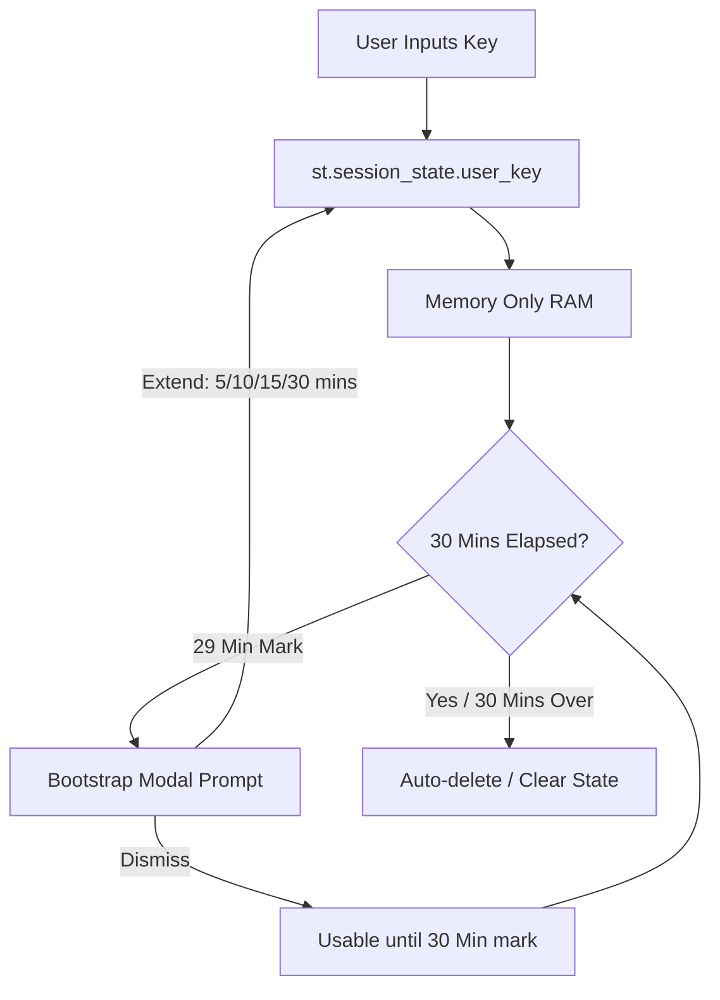

# API Usage and Key Management

This document describes how VisualBridge operates with and without a Gemini API key, and details the security and implementation guidelines for allowing external users to use their own keys.

---

## 1. Operation Without an API Key (Mock / Simulation Mode)

When the application starts without a valid `GEMINI_API_KEY` (or the placeholder is left intact in `.env`), it automatically boots into **Mock Mode**.

Contrary to expectation, users are **not strictly limited** to the 3 preconfigured templates (Neutral, Boy, and Girl). They can type custom text, which the system processes as follows:

- **No AI Text Simplification**: The Text Simplification Agent (Gemini) is disabled. The system falls back to a simple regular expression to split the input text into sentences at punctuation marks (`.`, `!`, `?`).
- **Heuristic Keyword Extraction**: Instead of smart AI mapping, the system uses a basic stopword filter to strip out common Hungarian and English structural words. Words longer than 2 characters that are not stopwords are treated as keywords.
- **Keyless Symbol Lookup**: The ARASAAC API is a free, public REST API and **does not require an API key**. The system queries these heurstically extracted keywords directly from the ARASAAC database.
- **Predefined Profiles**: The three default profiles (Neutral, Boy, Girl) use deterministic, pre-translated mock templates to showcase the ideal output quality of the AI model.

---

## 2. User-Provided API Key Integration

To allow users to access full Gemini-powered AI features without registering or sharing your server key, you can implement a front-end input form.

### Why URL-based Key Injection is NOT Recommended

Passing the API key as a query parameter in the URL (e.g., `https://visualbridge.app/?key=AIzaSy...`) is a security vulnerability:

1. **Browser History**: The key remains visible in the browser's navigation history.
2. **Server & Proxy Logs**: The URL is stored in plain text in webserver, reverse-proxy (e.g., Nginx, Apache), and CDN logs.

> *Note: Referer leakage is not an active issue at this time as there are no external reference pages.*

### Recommended Security Pattern: In-Memory Session State with Expiration

The safest way to handle user-provided keys is an **in-memory sidebar form** combined with a session expiration mechanism.

- **Storage**: Store the key in Streamlit's `st.session_state`. Session state data resides entirely in the server's RAM, bound to a specific WebSocket connection. It is never written to disk and is completely isolated from other users.
- **Transport**: All WebSocket communications must run over **HTTPS (WSS)** so the key is encrypted in transit.
- **User Interface (Collapsible Settings)**: The key input field is kept hidden inside a collapsible sidebar expander labeled with a key icon (`🔑 API Key Settings`). Inside this expander, the input field uses `type="password"` (hidden characters with a show/hide toggle).
- **Invalid Key Handling**: If a user enters an incorrect key and the API returns an authorization error, the app displays a prominent guide directing the user to reopen the expander and replace the key.
- **Absolute Expiration Timer**: The key is kept in memory for a maximum duration of **30 minutes from the time it was submitted**.
- **Session Extension Prompt**: Exactly **1 minute before expiration** (at the 29-minute mark), a Bootstrap modal dialog pops up, prompting the user if they wish to extend their session.
- **Extension Options**: If the user chooses to extend, they are presented with a selection of **5, 10, 15, or 30 minutes** to keep their session active. If the modal is dismissed, the key remains usable for the remaining 1 minute until the full 30-minute timer expires, at which point it is automatically cleared from `st.session_state`.
