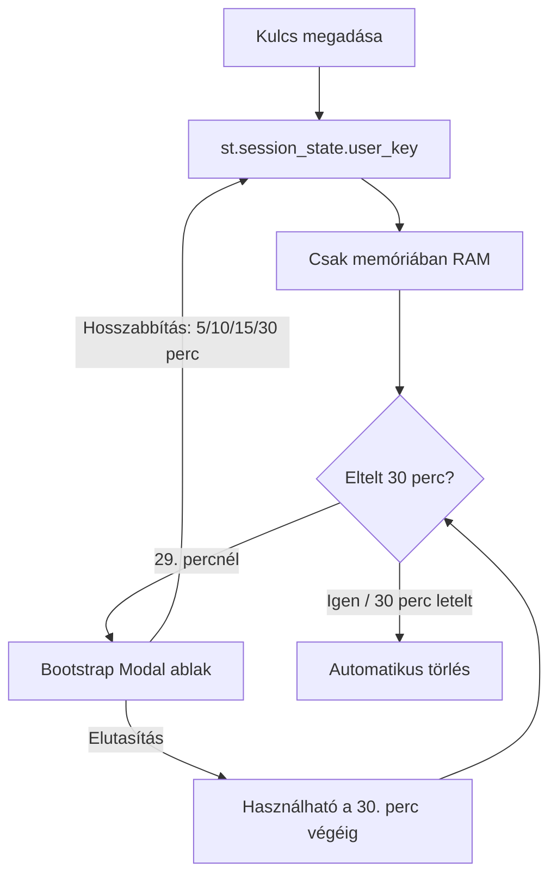

# API használat és kulcskezelés

Ez a dokumentum bemutatja, hogyan működik a VisualBridge Gemini API kulccsal és anélkül, valamint részletezi a biztonsági és implementációs irányelveket a saját kulcsok használatához.

---

## 1. API kulcs nélküli működés (Szimulációs / Mock mód)

Ha az alkalmazás érvényes `GEMINI_API_KEY` nélkül indul el (vagy a sablon érték szerepel a `.env` fájlban), automatikusan **Szimulációs (Mock) módba** lép.

A felhasználók ekkor **nem csak** a 3 előre beállított profilt (Semleges, Fiú, Lány) érik el, hanem beírhatnak tetszőleges egyedi szöveget is:

- **Nincs AI szöveg-egyszerűsítés**: A Gemini-alapú egyszerűsítő ágens nem fut le. A rendszer egy egyszerű reguláris kifejezéssel bontja mondatokra a szöveget az írásjelek (`.`, `!`, `?`) mentén.
- **Heurisztikus kulcsszó-kiemelés**: Intelligens szemantikai elemzés helyett egy beépített stopword-szűrő eltávolítja a gyakori magyar és angol szerkezeti szavakat. A 2 karakternél hosszabb, megmaradt szavakat a rendszer kulcsszónak tekinti.
- **Kulcs nélküli piktogram-keresés**: Az ARASAAC API egy szabadon hozzáférhető, nyilvános REST API, amelyhez **nincs szükség API kulcsra**. Így a heurisztikusan kinyert kulcsszavakhoz a rendszer továbbra is képes piktogramokat letölteni.
- **Előre definiált profilok**: A három alapértelmezett profil (Semleges, Fiú, Lány) determinisztikus, előre lefordított sablonokból dolgozik, hogy szemléltesse az AI modell által elérhető optimális minőséget.

---

## 2. Felhasználó által megadott API kulcs integrációja

Ha szeretné, hogy a látogatók regisztráció nélkül, a saját API kulcsukkal használhassák a teljes értékű Gemini modellt, egy felhasználói felületbe ágyazott beviteli mező a legalkalmasabb.

### Miért NEM javasolt az URL-alapú kulcsátadás?

Az API kulcs URL-paraméterként (pl. `https://visualbridge.app/?key=AIzaSy...`) történő továbbítása biztonsági kockázatot jelent:

1. **Böngészési előzmények**: A kulcs látható marad a böngésző előzményeiben (history).
2. **Szerver- és proxynaplók**: A teljes URL-t naplózzák a webszerverek (pl. Nginx, Apache), proxyk és CDN-ek hozzáférési naplói (access logs).

> *Megjegyzés: A Referer szivárgás nem jelent problémát, mivel nincsenek külső hivatkozási oldalak.*

### Javasolt biztonsági minta: Memóriabeli Session State időzítővel

A legbiztonságosabb megoldás egy **memóriabeli oldalsáv-űrlap**, kombinálva egy automatikus lejárati időzítővel.

- **Tárolás**: Mentse a kulcsot a Streamlit `st.session_state` objektumába. Ez az adat kizárólag a szerver RAM memóriájában létezik, az adott WebSocket kapcsolathoz rendelve. Nem íródik lemezre, és teljesen el van zárva a többi látogató elől.
- **Átvitel**: Minden WebSocket kommunikációnak **HTTPS (WSS)** protokollon keresztül kell zajlania, így a kulcs titkosítva utazik a hálózaton.
- **Felhasználói felület (Kulcs ikon panel)**: A beviteli mező egy kulcs ikonnal jelölt, összecsukható oldalsáv-panelben (`🔑 API kulcs beállításai / API Key Settings`) kap helyet, megőrizve a felület tisztaságát. Ezen belül a mező `type="password"` tulajdonsággal maszkolja a kulcsot (egy beépített szem ikon segítségével bármikor megjeleníthető a beírt szöveg).
- **Hibás kulcs kezelése**: Amennyiben érvénytelen kulcs kerül megadására, és az API hitelesítési hibát dob, az alkalmazás egyértelmű hibaüzenettel útba igazítja a felhasználót, hogy a panel megnyitásával cserélje le a kulcsot egy újra.
- **Abszolút lejárati időzítő**: A kulcs a **megadásától számított 30 percig érvényes** a memóriában.
- **Munkamenet meghosszabbítási felugró ablak**: Pontosan **1 perccel a lejárat előtt** (a 29. percnél) megjelenik egy Bootstrap modal ablak, amely megkérdezi a felhasználótól, hogy szeretné-e meghosszabbítani a munkamenetet.
- **Hosszabbítási opciók**: Ha a felhasználó a meghosszabbítás mellett dönt, választhat **5, 10, 15 vagy 30 perc** közötti időtartamot a munkamenet aktívan tartásához. Ha a felhasználó bezárja vagy elutasítja a modal ablakot, a kulcs a hátralévő maximum 1 percben továbbra is használható marad, és csak a teljes 30 perces időtartam leteltekor törlődik automatikusan a `st.session_state`-ből.
