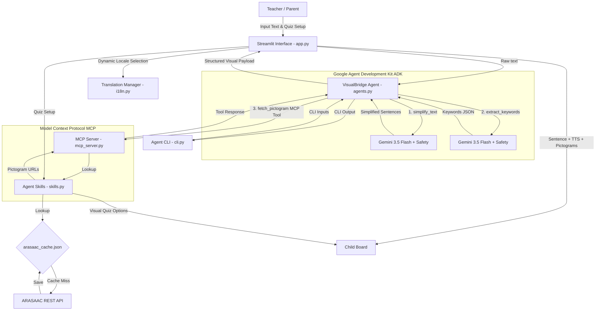
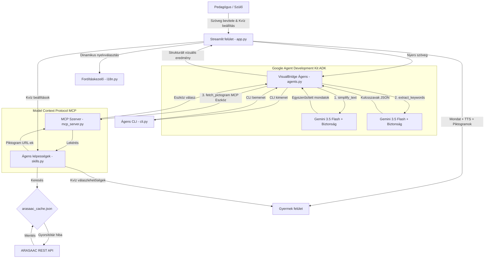

# VisualBridge – Vizuális Akadálymentesítő Asszisztens / Visual Accessibility Assistant


---

## Language / Nyelv

- [English](#english-documentation)
- [Magyar](#magyar-dokumentáció)

---

## English Documentation

**VisualBridge** is a visual accessibility application designed to support the education of children with Autism Spectrum Disorder (ASD), speech impairments, and special educational needs (SEN / SNI). By translating complex text into Easy-to-Read Communication (simplified sentences) and mapping them to standardized visual pictograms, VisualBridge builds a bridge of understanding for non-verbal and visual learners.

### Core Features

1. **Text Simplification Agent (Gemini-powered)**: Uses the Google Agent Development Kit (ADK) with `gemini-3.5-flash` model to convert complex paragraphs into simple, chronological sentences (conforming to Easy-to-Read standards).
2. **MCP Server Integration**: Includes a local Model Context Protocol (MCP) server exposing tools for pictogram mapping and quiz generation.
3. **Security & Safety Guardrails**: Robust safety filters (hate speech, harassment, etc.) configured directly on the Gemini model via the ADK.
4. **ARASAAC API Integration & Caching**: Direct API integration with the ARASAAC symbol repository, backed by a local JSON cache (`arasaac_cache.json`) to minimize external calls.
5. **Interactive Comprehension Quizzes**: Generates 3-option visual quizzes (1 correct answer, 2 distractors) to test child understanding, featuring celebratory screen animations.
6. **Native Text-to-Speech (TTS)**: Web Speech API integration for English and Hungarian voices.
7. **Bilingual Localization (i18n)**: Fully localized interface in English and Hungarian managed dynamically via `.po` files.
8. **Agent CLI**: A command-line interface (`cli.py`) allowing quick terminal-based testing and usage of the ADK agent.

---

### Architecture & System Design



- **`app.py`**: The main entrypoint. Handles layout partition and custom styling injection.
- **`agents.py`**: ADK coordinator agent utilizing `gemini-3.5-flash` with safety configuration.
- **`mcp_server.py`**: High-performance MCP server built with `FastMCP` exposing core capabilities as tools.
- **`cli.py`**: Command-line interface for the ADK agent.
- **`skills.py`**: Integrates external capabilities such as the ARASAAC API, cache management, and quiz logic.
- **`i18n.py`**: Pure Python translation catalog parser and lookup manager.
- **`langs/`**: Holds translation catalogs (`en.po`, `hu.po`).

---

### Installation & Setup

#### Prerequisites

- Python 3.10 or higher
- Streamlit

#### Step 1: Clone the repository and navigate to the project directory

```bash
cd 202606
```

#### Step 2: Set up a virtual environment

```bash
python3 -m venv venv
source venv/bin/activate
```

#### Step 3: Install dependencies

```bash
pip install -r requirements.txt
```

#### Step 4: Configuration

Create a `.env` file in the root directory by copying the example environment configuration:

```bash
cp .env.example .env
```

Open `.env` and fill in your Gemini API key:

```env
GEMINI_API_KEY=your_actual_gemini_api_key
```

> [!IMPORTANT]
> **Only Google Gemini API keys are supported!**
> Because this application is built using the official Google ADK (Agent Development Kit) and leverages the `gemini-3.5-flash` model, API keys from other providers (e.g. OpenAI, Claude, DeepSeek, Mistral) will fail to authenticate.
>
> **How to get a free Gemini API key?**
> You can obtain an API key for free (with generous free-tier limits) at [Google AI Studio](https://aistudio.google.com/).
>
> **Note:** If `GEMINI_API_KEY` is not provided or matches the placeholder, the application automatically boots into **Mock (Simulation) Mode** using preconfigured templates.

---

### Running the Application

To start the Streamlit web application:

```bash
streamlit run app.py
```

Open `http://localhost:8501` in your browser.

---

#### Running Tests

We maintain a comprehensive unit test suite in `test_app.py` covering mock simplification logic, API fallbacks, translation parsing, and quiz generation. Run the tests inside your activated virtual environment:

```bash
python3 -m unittest test_app.py
```

#### Running the Agent CLI

Interact with the VisualBridge ADK Agent directly from your terminal:

```bash
python3 cli.py --text "The car goes fast. The bus stops." --lang en
```

#### Running the MCP Server

Start the Model Context Protocol (MCP) server using the stdio transport:

```bash
python3 mcp_server.py
```

---

## Magyar dokumentáció

A **VisualBridge** egy vizuális akadálymentesítő alkalmazás, amely támogatja az autizmus spektrumzavarral (ASD), beszédfogyatékossággal és sajátos nevelési igényű (SNI) gyermekek oktatását. Az összetett oktatási szövegeket **könnyen érthető kommunikációvá** (tőmondatokká) alakítja, majd ezeket szabványosított vizuális piktogramokhoz társítja, így hidat képezve a non-verbális és vizuális tanulók számára.

## Fő Funkciók

1. **Szöveg-egyszerűsítő ágens (ADK-alapú)**: A Google Agent Development Kit (ADK) keretrendszert és a legújabb `gemini-3.5-flash` modellt használja az összetett mondatok egyszerű, időrendi tőmondatokká (könnyen érthető kommunikáció) alakítására.
2. **MCP Szerver integráció**: Helyi Model Context Protocol (MCP) szervert tartalmaz a képességek (piktogram leképezés, kvíz generálás) szabványos kiszolgálására.
3. **Beépített biztonsági szűrők (Security)**: A tartalom szűrése és a biztonsági beállítások közvetlenül az ADK ágens szintjén vannak konfigurálva.
4. **Ágens CLI**: Parancssori felület (`cli.py`) az ágens gyors és önálló terminál alapú tesztelésére és futtatására.
5. **ARASAAC API és Cache**: Közvetlen kapcsolat az ARASAAC szimbólumtárral, kiegészítve helyi JSON gyorsítótárral a hálózati terhelés csökkentésére.
6. **Interaktív szövegértési kvízek**: Vizuális kvízkérdéseket generál a megértés ellenőrzésére.
7. **Beépített hangfelolvasó (TTS)**: A böngésző natív hangszintetizátorát használja mindkét nyelven.
8. **Kétnyelvű lokalizáció (i18n)**: Teljesen kétnyelvű felület (magyar és angol), `.po` fájlok segítségével.

---

## Architektúra és felépítés



A projekt fájlstruktúrája és szerepkörei:

- **`app.py`**: A fő Streamlit modul. Kezeli a felület felosztását (bal/jobb oldal) és a CSS dizájn beillesztését.
- **`agents.py`**: ADK-alapú koordinátor ágens, amely kezeli a Gemini API-val (gemini-3.5-flash) való kommunikációt biztonsági beállításokkal.
- **`mcp_server.py`**: A FastMCP alapú helyi MCP szerver, amely eszközként teszi elérhetővé a piktogram leképezést.
- **`cli.py`**: Parancssori felület az ágens közvetlen indításához.
- **`skills.py`**: Programozott képességek (ARASAAC API hívás, kvíz generálás, gyorsítótár kezelés).
- **`i18n.py`**: Tisztán Pythonban megírt fordításkezelő, amely beolvassa a nyelvi `.po` fájlokat.
- **`langs/`**: A nyelvi fájlokat tartalmazó mappa (`en.po`, `hu.po`).

---

### Telepítés és beállítás

#### Előfeltételek

- Python 3.10 vagy újabb
- Telepített pip

#### 1. lépés: Másolja be a projekt mappájába

```bash
cd 202606
```

#### 2. lépés: Hozzon létre egy virtuális környezetet

```bash
python3 -m venv venv
source venv/bin/activate
```

#### 3. lépés: Telepítse a függőségeket

```bash
pip install -r requirements.txt
```

#### 4. lépés: Környezeti változók beállítása

Hozzon létre egy `.env` fájlt a gyökérkönyvtárban az `.env.example` lemásolásával:

```bash
cp .env.example .env
```

Nyissa meg a `.env` fájlt, és adja meg a Gemini API kulcsát:

```env
GEMINI_API_KEY=a_te_valodi_gemini_api_kulcsod
```

**Megjegyzés:**
> Ha a `GEMINI_API_KEY` üresen marad, az alkalmazás automatikusan **szimulációs (mock) módba** lép és a sablonokból dolgozik.

---

### Alkalmazás futtatása

A Streamlit alkalmazás elindítása:

```bash
streamlit run app.py
```

Nyissa meg a böngészőjében a `http://localhost:8501` címet.

---

#### Tesztek futtatása

Az automatizált unit tesztek futtatása a `test_app.py` fájlban az aktivált virtuális környezeten belül:

```bash
python3 -m unittest test_app.py
```

#### Ágens CLI futtatása

Futtassa az ágenst közvetlenül a terminálból:

```bash
python3 cli.py --text "Az autó megy. A busz megáll." --lang hu
```

#### MCP Szerver indítása

Indítsa el a Model Context Protocol (MCP) szervert:

```bash
python3 mcp_server.py
```
