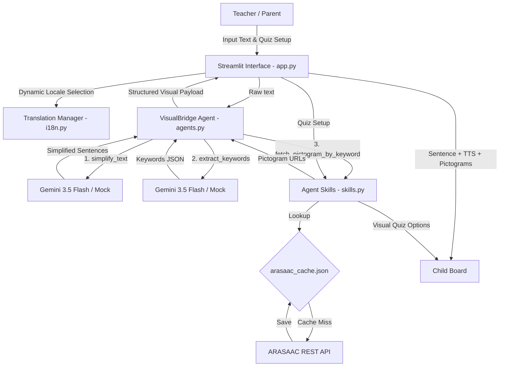

# VisualBridge – Visual Accessibility Assistant


**VisualBridge** is a visual accessibility application designed to support the education of children with Autism Spectrum Disorder (ASD), speech impairments, and special educational needs (SEN / SNI). By translating complex text into Easy-to-Read Communication (simplified sentences) and mapping them to standardized visual pictograms, VisualBridge builds a bridge of understanding for non-verbal and visual learners.

## Core Features

1. **Text Simplification Agent (Gemini-powered)**: Uses `gemini-3.5-flash` via the official `google-genai` SDK to convert complex paragraphs into simple, chronological, and active-voice sentences (conforming to Easy-to-Read standards).
2. **Pictogram Mapping Agent**: Extracts key visual concepts (nouns, verbs, attributes) from the simplified text and maps them to standard symbols from the international ARASAAC library.
3. **ARASAAC API Integration & Caching**: Direct API integration with the ARASAAC symbol repository, backed by a local JSON cache (`arasaac_cache.json`) to minimize external calls and speed up loads.
4. **Interactive Comprehension Quizzes**: Generates 3-option visual quizzes based on the simplified text (1 correct answer, 2 distractors) to test child understanding, featuring celebratory screen animations (balloons).
5. **Native Text-to-Speech (TTS)**: One-click "Read Aloud" buttons utilizing native browser Web Speech API (SpeechSynthesis) supporting both English and Hungarian voices.  
  5.1. The Hungarian voice is not the best in the browser, so I extended the feature with the ability to read the pictograms on the right side as well.
6. **Bilingual Localization (i18n)**: Fully localized interface in English and Hungarian managed dynamically via translation catalogs (`.po` files) in `langs/`.
7. **Premium Responsive UI**: A Streamlit frontend customized with dark/light responsive styling, child-friendly layouts, hover effects, and custom CSS banners.
8. **Simulated (Mock) Mode**: Works out-of-the-box without an active Gemini API key using deterministic templates, enabling local testing and development.

---

## Architecture & System Design



- **`app.py`**: The main entrypoint. Handles layout partition (Left: Teacher/Parent panel, Right: Child game board) and custom styling injection.
- **`agents.py`**: Multi-agent coordinator. Manages interactions with the Gemini API or switches to mock fallbacks.
- **`skills.py`**: Integrates external capabilities such as the ARASAAC API, cache management, and quiz logic.
- **`i18n.py`**: Pure Python translation catalog parser and lookup manager.
- **`langs/`**: Holds translation catalogs (`en.po`, `hu.po`).

---

## Installation & Setup

### Prerequisites

- Python 3.10 or higher
- Streamlit

### Step 1: Clone the repository and navigate to the project directory

```bash
cd 202606
```

### Step 2: Set up a virtual environment

```bash
python3 -m venv venv
source venv/bin/activate
```

### Step 3: Install dependencies

```bash
pip install -r requirements.txt
```

### Step 4: Configuration

Create a `.env` file in the root directory by copying the example environment configuration:

```bash
cp .env.example .env
```

Open `.env` and fill in your Gemini API key:

```env
GEMINI_API_KEY=your_actual_gemini_api_key
```

> If `GEMINI_API_KEY` is not provided or matches the placeholder, the application automatically boots into **Mock (Simulation) Mode** using preconfigured templates.

---

## Running the Application

To start the Streamlit web application:

```bash
streamlit run app.py
```

Open `http://localhost:8501` in your browser.

---

### Running Tests

We maintain a comprehensive unit test suite in `test_app.py` covering mock simplification logic, API fallbacks, translation parsing, and quiz generation. Run the tests inside your activated virtual environment:

```bash
python3 -m unittest test_app.py
```
