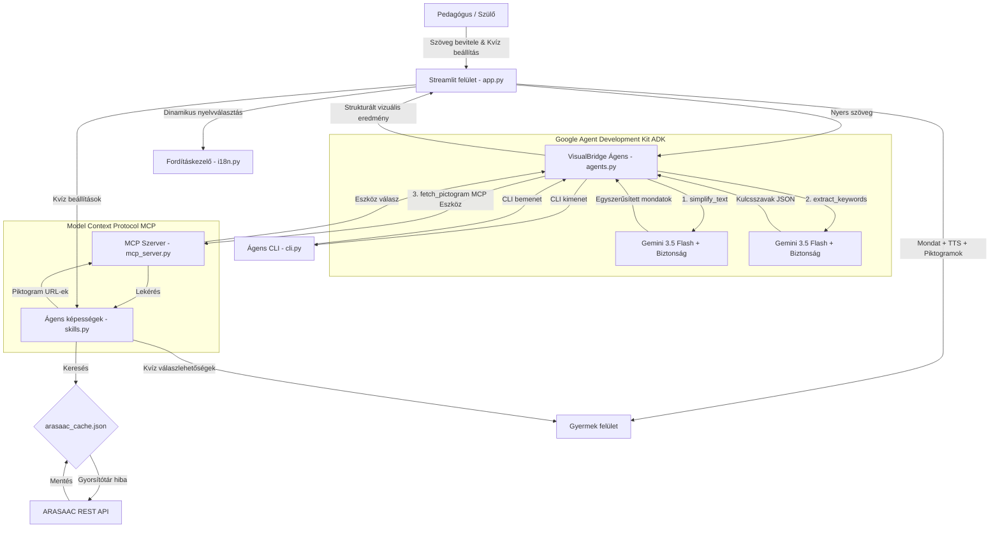

# VisualBridge – Vizuális Akadálymentesítő Asszisztens


A **VisualBridge** egy vizuális akadálymentesítő alkalmazás, amely támogatja az autizmus spektrumzavarral (ASD), beszédfogyatékossággal és sajátos nevelési igényű (SNI) gyermekek oktatását. Az összetett oktatási szövegeket **könnyen érthető kommunikációvá** (tőmondatokká) alakítja, majd ezeket szabványosított vizuális piktogramokhoz társítja, így hidat képezve a non-verbális és vizuális tanulók számára.

## Fő Funkciók

1. **Szöveg-egyszerűsítő ágens (ADK-alapú)**: A Google Agent Development Kit (ADK) keretrendszert és a legújabb `gemini-3.5-flash` modellt használja az összetett mondatok egyszerű, időrendi tőmondatokká (könnyen érthető kommunikáció) alakítására.
2. **MCP Szerver integráció**: Helyi Model Context Protocol (MCP) szervert tartalmaz a képességek (piktogram leképezés, kvíz generálás) szabványos kiszolgálására.
3. **Beépített biztonsági szűrők (Security)**: A tartalom szűrése és a biztonsági beállítások közvetlenül az ADK ágens szintjén vannak konfigurálva.
4. **Ágens CLI**: Parancssori felület (`cli.py`) az ágens gyors és önálló terminál alapú tesztelésére és futtatására.
5. **ARASAAC API és Cache**: Közvetlen kapcsolat az ARASAAC szimbólumtárral, kiegészítve helyi JSON gyorsítótárral a hálózati terhelés csökkentésére.
6. **Interaktív szövegértési kvízek**: Vizuális kvízkérdéseket generál a megértés ellenőrzésére.
7. **Beépített hangfelolvasó (TTS)**: A böngésző natív hangszintetizátorát használja mindkét nyelven.
8. **Kétnyelvű lokalizáció (i18n)**: Teljesen kétnyelvű felület (magyar és angol), `.po` fájlok segítségével.

---

## Architektúra és felépítés



A projekt fájlstruktúrája és szerepkörei:

- **`app.py`**: A fő Streamlit modul. Kezeli a felület felosztását (bal/jobb oldal) és a CSS dizájn beillesztését.
- **`agents.py`**: ADK-alapú koordinátor ágens, amely kezeli a Gemini API-val (gemini-3.5-flash) való kommunikációt biztonsági beállításokkal.
- **`mcp_server.py`**: A FastMCP alapú helyi MCP szerver, amely eszközként teszi elérhetővé a piktogram leképezést.
- **`cli.py`**: Parancssori felület az ágens közvetlen indításához.
- **`skills.py`**: Programozott képességek (ARASAAC API hívás, kvíz generálás, gyorsítótár kezelés).
- **`i18n.py`**: Tisztán Pythonban megírt fordításkezelő, amely beolvassa a nyelvi `.po` fájlokat.
- **`langs/`**: A nyelvi fájlokat tartalmazó mappa (`en.po`, `hu.po`).

---

## Telepítés és beállítás

### Előfeltételek

- Python 3.10 vagy újabb
- Telepített pip

### 1. lépés: Másolja be a projekt mappájába

```bash
cd 202606
```

### 2. lépés: Hozzon létre egy virtuális környezetet

```bash
python3 -m venv venv
source venv/bin/activate
```

### 3. lépés: Telepítse a függőségeket

```bash
pip install -r requirements.txt
```

### 4. lépés: Környezeti változók beállítása

Hozzon létre egy `.env` fájlt a gyökérkönyvtárban az `.env.example` lemásolásával:

```bash
cp .env.example .env
```

Nyissa meg a `.env` fájlt, és adja meg a Gemini API kulcsát:

```env
GEMINI_API_KEY=a_te_valodi_gemini_api_kulcsod
```

**Megjegyzés:**
> Ha a `GEMINI_API_KEY` üresen marad, az alkalmazás automatikusan **szimulációs (mock) módba** lép és a sablonokból dolgozik.

---

## Alkalmazás futtatása

A Streamlit alkalmazás elindítása:

```bash
streamlit run app.py
```

Nyissa meg a böngészőjében a `http://localhost:8501` címet.

---

### Tesztek futtatása

Az automatizált unit tesztek futtatása a `test_app.py` fájlban az aktivált virtuális környezeten belül:

```bash
python3 -m unittest test_app.py
```

### Ágens CLI futtatása

Futtassa az ágenst közvetlenül a terminálból:

```bash
python3 cli.py --text "Az autó megy. A busz megáll." --lang hu
```

### MCP Szerver indítása

Indítsa el a Model Context Protocol (MCP) szervert:

```bash
python3 mcp_server.py
```
