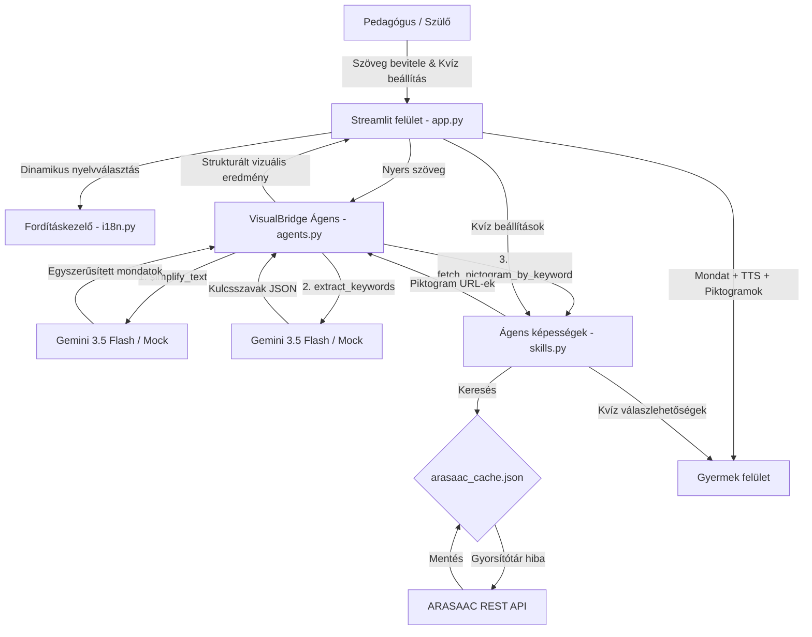

# VisualBridge – Vizuális Akadálymentesítő Asszisztens


A **VisualBridge** egy vizuális akadálymentesítő alkalmazás, amely támogatja az autizmus spektrumzavarral (ASD), beszédfogyatékossággal és sajátos nevelési igényű (SNI) gyermekek oktatását. Az összetett oktatási szövegeket **könnyen érthető kommunikációvá** (tőmondatokká) alakítja, majd ezeket szabványosított vizuális piktogramokhoz társítja, így hidat képezve a non-verbális és vizuális tanulók számára.

## Fő Funkciók

1. **Szöveg-egyszerűsítő ágens (Gemini-alapú)**: A `gemini-3.5-flash` modellt használja a hivatalos `google-genai` SDK-n keresztül a bonyolult szövegek egyszerű, időrendi és aktív szerkezetű tőmondatokká (könnyen érthető szabályok) alakítására.
2. **Piktogram-leképező ágens**: Kigyűjti a vizuálisan megjeleníthető kulcsszavakat (főneveket, igéket, tulajdonságokat) az egyszerűsített szögből, és párosítja azokat az ARASAAC könyvtár megfelelő szimbólumaival.
3. **ARASAAC API integráció és gyorsítótár (Caching)**: Közvetlen REST API kapcsolat a nemzetközi ARASAAC adatbázissal, kiegészítve egy helyi JSON cache (`arasaac_cache.json`) fájllal a hálózati terhelés minimalizálása és a gyorsabb betöltés érdekében.
4. **Interaktív szövegértési kvízek**: Vizuális kvízkérdéseket generál a megadott szavakból (1 helyes válasz piktogrammal, 2 tévesztő opció) a megértés ellenőrzésére. A sikeres választ látványos lufis animáció ünnepli.
5. **Beépített hangfelolvasó (TTS)**: "Felolvasás" gombok a mondatok mellett, amelyek a böngésző natív hangszintetizátorát (SpeechSynthesis) használják magyar és angol nyelven.  
  5.1. A magyar nyelvű kiejtés sajnos nem a legideálisabb a böngészőben, ezért bővítettem a funkciót azzal, hogy a jobb oldalon a piktogramokat is fel tudja olvasni.
6. **Kétnyelvű lokalizáció (i18n)**: Teljesen kétnyelvű (magyar és angol) felület, amelyet dinamikusan kezel a `langs/` könyvtárban található `.po` fordítási katalógusok segítségével.
7. **Prémium felhasználói felület**: Streamlit alapú reszponzív felület egyedi Bootstrap CSS-sel, gyerekbarát elrendezésekkel, animált gombokkal és lebegő piktogram kártyákkal.
8. **Szimulációs (Mock) üzemmód**: Gemini API kulcs nélkül is azonnal működik előre definiált sablonok segítségével, így ideális a tesztelésre és a kipróbálásra.

---

## Architektúra és felépítés



A projekt fájlstruktúrája és szerepkörei:

- **`app.py`**: A fő Streamlit modul. Kezeli a felület felosztását (bal oldal: pedagógus / szülő felület, jobb oldal: gyermekfelület) és a prémium CSS dizájn beillesztését.
- **`agents.py`**: Az ágensek koordinátora. Kezeli a Gemini API-val való kommunikációt vagy a mock szimulációt.
- **`skills.py`**: Programozott képességek (ARASAAC API hívás, kvíz generálás, gyorsítótár kezelés).
- **`i18n.py`**: Tisztán Pythonban megírt fordításkezelő, amely beolvassa a nyelvi `.po` fájlokat.
- **`langs/`**: A nyelvi fájlokat tartalmazó mappa (`en.po`, `hu.po`).

---

## Telepítés és beállítás

### Előfeltételek

- Python 3.10 vagy újabb
- Telepített pip

### 1. lépés: Másolja be a projekt mappájába

```bash
cd 202606
```

### 2. lépés: Hozzon létre egy virtuális környezetet

```bash
python3 -m venv venv
source venv/bin/activate
```

### 3. lépés: Telepítse a függőségeket

```bash
pip install -r requirements.txt
```

### 4. lépés: Környezeti változók beállítása

Hozzon létre egy `.env` fájlt a gyökérkönyvtárban az `.env.example` lemásolásával:

```bash
cp .env.example .env
```

Nyissa meg a `.env` fájlt, és adja meg a Gemini API kulcsát:

```env
GEMINI_API_KEY=a_te_valodi_gemini_api_kulcsod
```

**Megjegyzés:**
> Ha a `GEMINI_API_KEY` üresen marad, az alkalmazás automatikusan **szimulációs (mock) módba** lép és a sablonokból dolgozik.

---

## Alkalmazás futtatása

A Streamlit alkalmazás elindítása:

```bash
streamlit run app.py
```

Nyissa meg a böngészőjében a `http://localhost:8501` címet.

---

### Tesztek futtatása

Az automatizált unit tesztek futtatása a `test_app.py` fájlban az aktivált virtuális környezeten belül:

```bash
python3 -m unittest test_app.py
```
